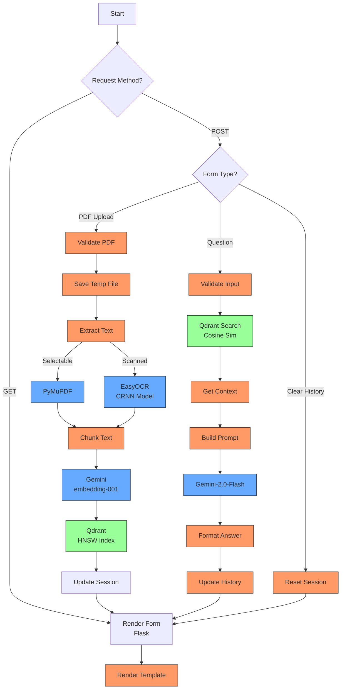

### Model-to-Function Mapping Table:

| Step | Technology | Model Used | Model Type | Key Specs |
|------|------------|------------|------------|-----------|
| PDF Text Extract | PyMuPDF | - | Rule-based | PDF parsing |
| Scanned PDF OCR | EasyOCR | CRNN | CNN+LSTM | 90%+ accuracy |
| Text Embeddings | Gemini | embedding-001 | Transformer | 768-dim vectors |
| Vector Search | Qdrant | HNSW | Graph-based | Cosine similarity |
| Answer Generation | Gemini | gemini-2.0-flash | Transformer | 128K context |

### Legend:
- **Blue Nodes**: AI/ML Models
- **Green Nodes**: Storage/DB Systems
- **Orange Nodes**: Technical Processes

